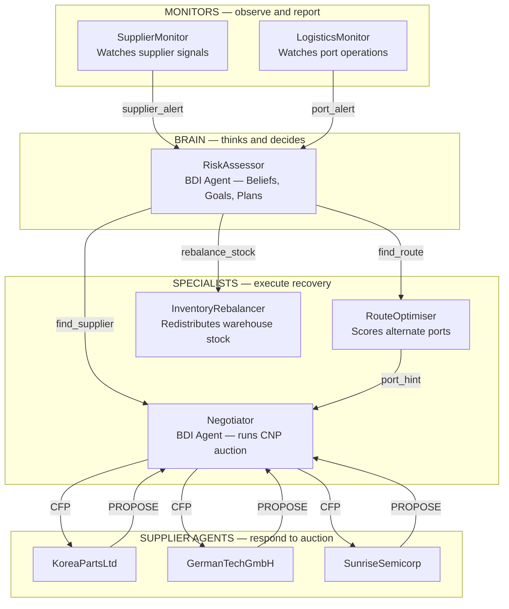
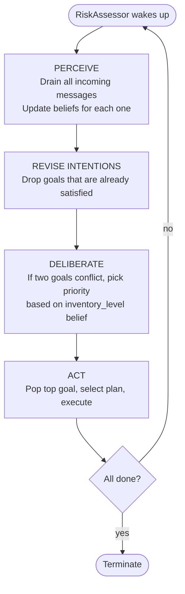
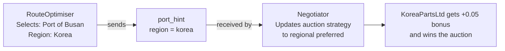

# Multi-Agent Supply Chain System

A multi-agent system built with [SPADE](https://spade-mas.readthedocs.io/) (Python 3.12) that handles two simultaneous supply chain disruptions. Agents communicate over XMPP, use BDI reasoning, and run a real Contract Net Protocol auction.

---

## Agents



---

## Scenarios

**Scenario 1 — Supplier Disruption**

TaiwanChipCo shows payment delays. RiskAssessor assesses severity and either runs a CNP auction (normal inventory) or triggers both the auction and a stock rebalance in parallel (critical inventory).

**Scenario 2 — Port Strike**

Port of Manila announces a strike. RiskAssessor picks a recovery plan based on whether a supplier crisis is also active — balanced scoring normally, speed-only if urgent. The selected port region is forwarded to Negotiator as a proximity hint.

---

## BDI Loop



---

## Cross-Scenario Cooperation

RouteOptimiser (Scenario 2) sends a `port_hint` to Negotiator (Scenario 1). If the hint is available, Negotiator applies a proximity bonus to suppliers in the same region as the selected port. This can change the auction winner.



---

## Requirements

- Python 3.12 (not 3.13 — SPADE is incompatible)
- Docker

---

## Setup

**1. Create a virtual environment with Python 3.12**

```bash
python3.12 -m venv venv
source venv/bin/activate
```

**2. Install dependencies**

```bash
pip install spade packaging
```

---

## How to Run

**Step 1 — Start the XMPP server (Docker)**

```bash
./spade-setup/start-spade.sh
```

Wait a few seconds for Prosody to start before running agents.

**Step 2 — Run the simulation**

```bash
python -u main.py
```

The `-u` flag disables output buffering so you see logs in real time.

**Step 3 — Stop everything**

```bash
./spade-setup/stop-spade.sh
```

---

## Web UIs

Available while the simulation is running:

| Agent               | URL                           |
|---------------------|-------------------------------|
| SupplierMonitor     | http://localhost:10005/spade  |
| LogisticsMonitor    | http://localhost:10004/spade  |
| RiskAssessor        | http://localhost:10003/spade  |
| Negotiator          | http://localhost:10002/spade  |
| RouteOptimiser      | http://localhost:10001/spade  |
| InventoryRebalancer | http://localhost:10000/spade  |

Supplier agents (KoreaPartsLtd, GermanTechGmbH, SunriseSemicorp) run in the background with no web UI.

---

## Project Structure

```
main.py                 — starts all agents
agents.json             — JIDs, passwords, web ports for main agents
risk_assessor.py        — BDI agent (core decision maker)
negotiator.py           — BDI agent (CNP auction)
supplier_monitor.py     — detects supplier anomalies
logistics_monitor.py    — detects port disruptions
route_optimiser.py      — scores alternate ports
inventory_rebalancer.py — redistributes warehouse stock
supplier_agents.py      — KoreaPartsLtd, GermanTechGmbH, SunriseSemicorp
diagrams-html/          — 9 presentation slides (open in browser)
```
